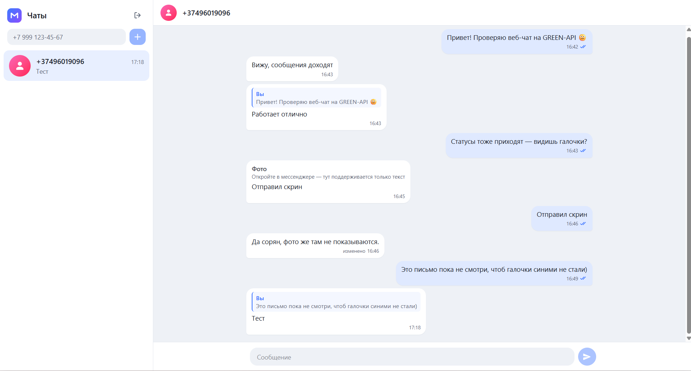
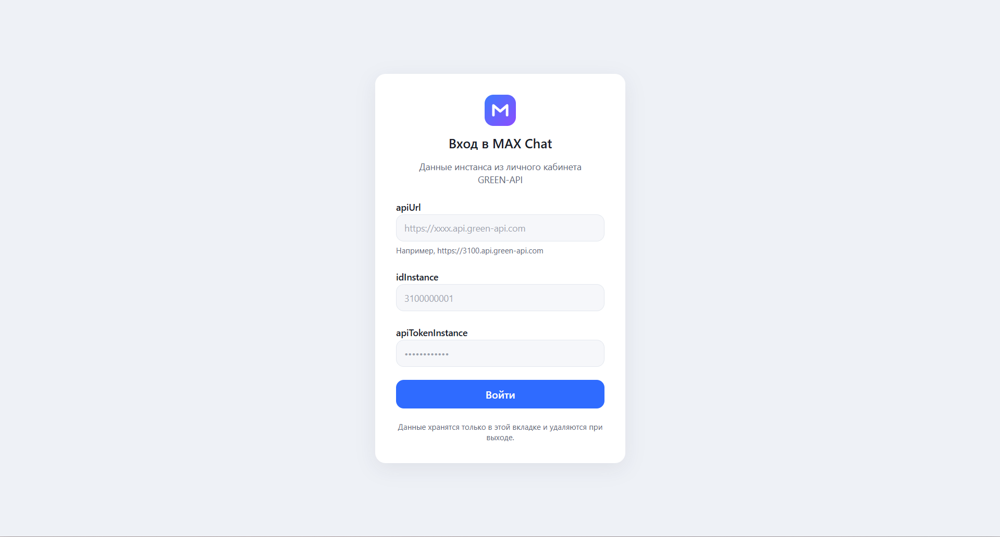
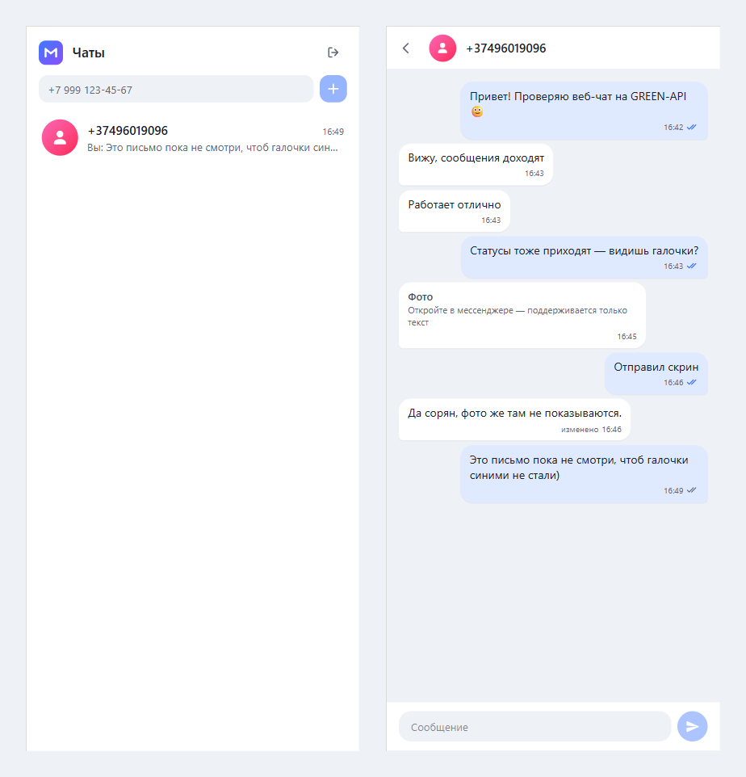
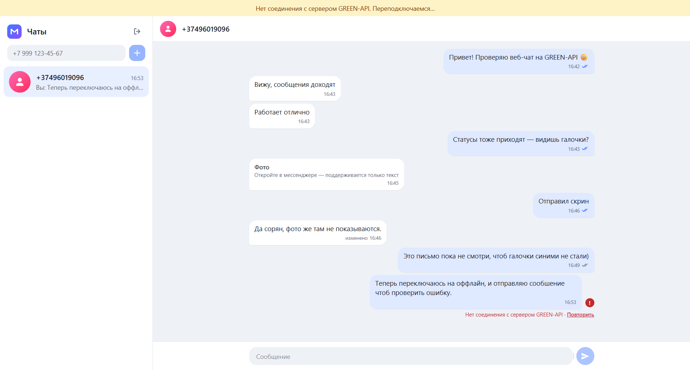
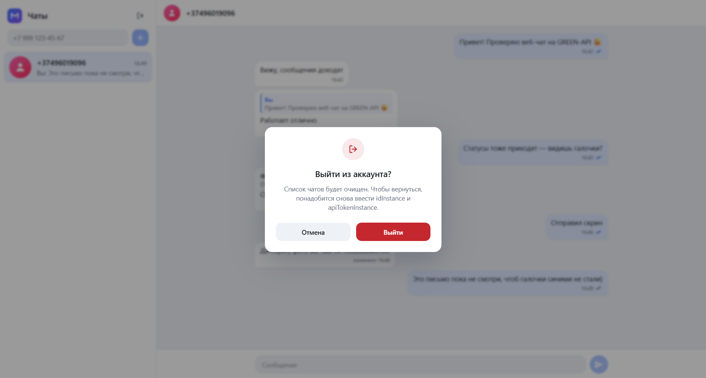

# MAX Chat · GREEN-API

A minimal web chat for sending and receiving text messages in the **MAX** messenger through [GREEN-API](https://green-api.com/max).
The UI follows the layout of [web.max.ru](https://web.max.ru/): chat list on the left, conversation on the right.

MAX (v3) and Telegram instances of GREEN-API share the same API, so the same build works with both — the messenger is defined only by the instance you log in with.
Tested end-to-end on a **MAX** instance and on a **Telegram** instance.

**Live demo:** _add the Vercel URL here_

## Screenshots



| Login                                   | Mobile                                           |
| --------------------------------------- | ------------------------------------------------ |
|  |  |

| Connection lost: retry and reconnect      | Log out                                    |
| ----------------------------------------- | ------------------------------------------ |
|  |  |

## Features

- Login with `apiUrl`, `idInstance`, `apiTokenInstance`; the credentials are verified with `getStateInstance` before entering.
- New chat by recipient phone number: the number is resolved to a `chatId` with `checkAccount` (unregistered numbers are rejected before any message is sent).
- Sending text messages with [`sendMessage`](https://green-api.com/v3/docs/api/sending/SendMessage/) and an optimistic UI:
  🕓 sending → ✓ sent → ✓✓ delivered → ✓✓ (blue) read, or a red **!** with the error and a **Retry** button.
- Receiving messages with the [HTTP API technology](https://green-api.com/v3/docs/api/receiving/technology-http-api/) (`receiveNotification` + `deleteNotification`).
- Chat history loaded with `getChatHistory` when a chat is opened.
- Incoming messages from a new contact create a new chat; unread counters.
- Replies show the quoted message above the text, as in MAX.
- Edited messages are updated in place (marked "edited"), deleted messages disappear — both live and in the history.
- Session survives a page reload (`sessionStorage`): credentials, chats, the last message of each chat and unread counters. **Log out** clears it.
- Responsive: on narrow screens the list and the conversation are shown one at a time.

Only text messages (including replies to a message) and personal chats are supported, as required by the task.
Other message types are shown as a placeholder ("Photo — open it in the messenger"); reactions are ignored.

## Tech stack

React 19 · TypeScript (strict) · Vite · Tailwind CSS 4. No other runtime dependencies.
Vitest, ESLint (typescript-eslint, react-hooks) and Prettier for development.

## Run locally

Requirements: Node.js 22.12+ (or 24+).

```bash
npm install
npm run dev      # http://localhost:5173
npm run build    # type check + production build into dist/
npm test         # unit tests (Vitest)
npm run lint     # ESLint
npm run format   # Prettier
npm run check    # type check + lint + format check + tests
```

## GREEN-API instance setup

1. Register at [console.green-api.com](https://console.green-api.com) and create an instance (MAX or Telegram, the free Developer plan is enough).
   If the MAX plans are not listed, set the country to Russia or Belarus in the profile settings (advice from GREEN-API support).
2. Authorize the instance (scan the QR code with the messenger app).
3. In the instance settings:
   - leave **webhookUrl empty** — otherwise notifications are sent to the webhook and not to the HTTP API queue;
   - enable notifications about **incoming messages**, **outgoing messages**, **outgoing message statuses**, **edited messages**, **deleted messages** and (optionally) **instance state**.
4. Copy `apiUrl`, `idInstance` and `apiTokenInstance` from the instance page into the login form.
   `apiUrl` differs between instances — use the one shown for your instance.

> MAX accounts registered outside Russia/Belarus can start a chat only with users who have them in their contacts — a limitation of the MAX messenger itself.

## How it works

```
src/
  api/            GREEN-API client: fetch wrapper with timeouts, endpoints, errors, the receive loop — no React
  state/          chatReducer (all state transitions), message helpers, API → Message mappers, notification handling
  lib/            sessionStorage, phone, URL, date and instance state helpers
  components/     reusable UI without app logic: ui/ (Avatar, Banner, ConfirmDialog, …) and icons/
  features/
    auth/         LoginScreen; components/, utils/ (credentials validation)
    messenger/    Messenger (the main screen); components/ (banners), hooks/ (useChat, useNotificationPolling)
    sidebar/      Sidebar; components/ (chat list, new chat form), utils/ (phone → chatId)
    chat/         ChatWindow, EmptyChat; components/ (header, message list, bubbles, composer)
```

Every folder with code has an `index.ts` that lists what it exposes, and code outside the folder imports only from it:
`@/features/chat`, `@/api`, or `./components` inside a feature. Files of one folder import each other directly, never
through their own index (that would create import cycles). A feature keeps its public components next to `index.ts`
and its internals in `components/`, `hooks/` and `utils/`; a subfolder appears with its first file.
ESLint enforces the boundaries: no imports of a file inside another folder and no relative paths out of a feature.

**State.** `useReducer` with a single pure reducer. Messages change in response to events from three sources — the user, API responses and notifications — and every transition lives in one place. Redux would be overkill for one screen.

**Receiving.** A sequential `while` loop instead of `setInterval`: `receiveNotification` is long polling (the request waits up to 20 s), so requests must not overlap. Each notification is handled and then deleted; until it is deleted the API returns it again, so handling is idempotent. The loop is stopped with an `AbortController` on unmount (this also prevents two loops under React StrictMode in development). On network errors it shows a "reconnecting" banner and retries every 5 s.

**One receiver per instance.** A notification taken from the queue by one browser tab never reaches another one. A [Web Lock](https://developer.mozilla.org/docs/Web/API/Web_Locks_API) lets only one tab of the same instance poll; a second tab shows a notice and takes over when the first one is closed.

**Chat id.** Messages are sent by `chatId`, not by phone number, as the GREEN-API docs recommend: incoming notifications always carry the `chatId`, so a chat keyed by the phone number would split into two.

**Deduplication.** The same message can arrive from several sources: the `sendMessage` response, the `outgoingAPIMessageReceived` notification (sometimes before the response), the chat history, or a repeated notification. All of them are merged by `idMessage`; a delivery status can only move forward (an old "delivered" never overwrites "read").

**Errors.** The raw server response is never shown to the user: GREEN-API error bodies contain the request path, which includes the API token. Errors are mapped by HTTP status to short messages. Every request has a client-side timeout, so a hung connection does not leave a message "sending" forever. A `401/403` logs the user out with an explanation; network errors only show a banner, so a lost connection does not end the session. A render error shows a fallback screen instead of a blank page.

**Credentials.** `apiTokenInstance` gives full access to the messenger account, so it is kept in `sessionStorage` (cleared when the tab is closed), not in `localStorage`, and only `https` API URLs are accepted. There is no backend, so the token is necessarily present in the browser — it is also part of every request URL by GREEN-API design. A production version would keep the token on a server (a small proxy) and give the browser a session cookie instead.

## Known limitations

- The chat list exists only in the current browser session: GREEN-API has no method to delete a chat, and the list is not loaded from the server.
- Retrying a message whose response was lost on the way back can send it twice (the API has no idempotency key).
- Only unit tests: reducer, mappers, the API client, the receive loop and helpers. There are no component tests.

## Deployment

The `dist/` folder is a static SPA. Deployed on Vercel (`vercel.json` serves `index.html` for any path).
